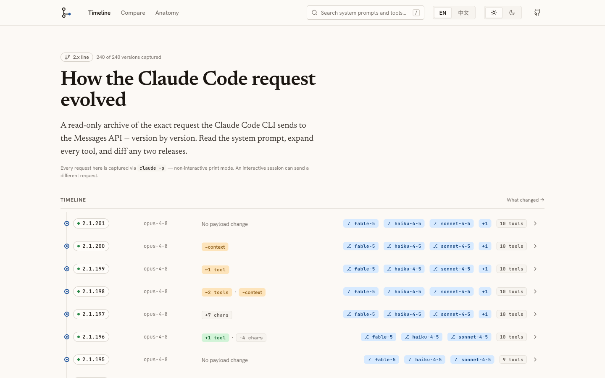

<div align="center">

# claude-code-api-requests

**English** | [中文](README.zh-CN.md)

[](https://github.com/Hoper-J/claude-code-api-requests/actions/workflows/gates.yml) [](LICENSE)

**Live site: [api-requests.cc](https://api-requests.cc)** · [Atom feed](https://api-requests.cc/feed.xml)



</div>

I'd always been curious how an industry-bellwether product like Claude Code handles and organizes context. After some digging, this project is what came out of it — here you can see how Claude Code's default request evolved across the 2.x line. The changes are genuinely interesting, for example:

- How are CLAUDE.md, memory, hook output, and the skill list organized into the request body? ([anatomy →](https://api-requests.cc/#/en/anatomy))
- The official advice to use `ToolSearch` to cut MCP's context footprint — which version actually introduced it, and how does it behave? ([full walkthrough →](corpus/findings.md))
- Fable-5 vs Opus-4-8: the changes to the Harness section of the System block, plus the new "Communicating with the user" part ([2.1.170 Opus-4-8 vs Fable-5 →](https://api-requests.cc/#/en/diff/2.1.170/2.1.170@claude-fable-5-1m))
- How the request evolved along a fixed model family — switch the timeline to a family axis ([sonnet lens →](https://api-requests.cc/#/en/lens/sonnet))

## Quick start

Visit the [live site](https://api-requests.cc), or clone and run `./serve.sh`:

```bash
git clone https://github.com/Hoper-J/claude-code-api-requests && cd claude-code-api-requests
./serve.sh        # → http://localhost:4173/ (data builds automatically, browser opens)
```

You can also just open `claude-code-api-requests-offline.html` at the repo root.

## Capturing / adding versions

`capture/` has a set of scripts that write corpus straight into `corpus/` (needs [ccwrap](https://github.com/Hoper-J/ccwrap), install with `npm i -g @hoper-j/ccwrap`, plus a one-time isolated login — see [capture/README.md](capture/README.md)):

```bash
./capture/capture.sh --force --skip-preflight                       # full re-capture
./capture/capture.sh --only "2.1.170" --refresh-versions --force --skip-preflight    # add one version
```

### Sanitization

The data files in `corpus/` are **masked in place** by `sanitize/sanitize.js`, preserving each value's shape (details in [sanitize/README.md](sanitize/README.md)): metadata.user_id (`account_uuid`/`device_id`/`session_id`), operator email, local paths, session-uuid headers, TLS fingerprints. Authorization is redacted by ccwrap at capture time.

## CLI overview

| Command | What it does | Docs |
|---|---|---|
| `./serve.sh [--no-open]` (`PORT=` to change port) | One-command local preview | [site/README.md](site/README.md) |
| `capture/capture.sh …` | Capture (**auto-sanitizes**); flags: `--only`/`--force`/`--reclassify`/`--variant --model`/`--help` | [capture/README.md](capture/README.md) |
| `capture/watch-versions.sh [--push\|--install-launchd]` | Poll npm for new versions: capture → sanitize → refresh changelog snapshot → rebuild data + offline product | [capture/README.md](capture/README.md) |
| `node sanitize/sanitize.js [--check]` | Sanitize; `--check` verifies without writing | [sanitize/README.md](sanitize/README.md) |
| `node site/scripts/build-data.js corpus [--emit-json site/public/data]` | corpus → `data.js` + static JSON API, with built-in PII detection | [site/README.md](site/README.md) |
| `node site/scripts/build-changelog.js` | Official changelog snapshot → `changelog-data.js` | [corpus/changelog/README.md](corpus/changelog/README.md) |
| `node site/scripts/build-changelog-zh.js [--status\|--missing\|--check\|--apply\|--apply-list]` | Chinese-translation pipeline (agent interface) | [site/i18n/README.md](site/i18n/README.md) |
| `node site/scripts/build-offline.js` | Offline single-file reader `claude-code-api-requests-offline.html` | [site/vendor/README.md](site/vendor/README.md) |
| `node site/scripts/build-feed.js` | Atom feeds `feed.xml` / `feed.zh-CN.xml` from the built artifacts (run last) | [site/README.md](site/README.md) |

## Notes

- `corpus/` is an **archive** of the API requests the Claude Code CLI actually sends — the system prompts, tool definitions, and so on are authored by Anthropic and remain their property; they are shown here for **educational and research** use only.
- The corpus baseline (2.0.0–2.1.201, every version and pinned-model variant) was captured in one pass on a single day in one environment; newer versions are added as they ship. Within the baseline, cross-version differences read as version signal rather than capture-date drift.
- `corpus/changelog/` is a snapshot of the official `anthropics/claude-code` CHANGELOG.md; the accompanying translations are build-time helper content, with the English original taking precedence.
- This repo's MIT license covers only this repo's code, build pipeline, site implementation, and documentation arrangement — it makes no claim over the corpus content.
- If a rights holder objects to any content, open an issue and it will be removed.
- The self-hosted fonts (Newsreader / Hanken Grotesk / JetBrains Mono) are SIL OFL 1.1; license text in [site/public/assets/fonts/LICENSE-OFL.md](site/public/assets/fonts/LICENSE-OFL.md).
