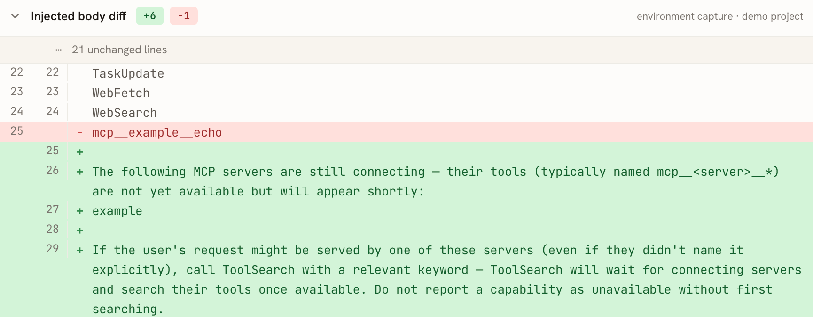
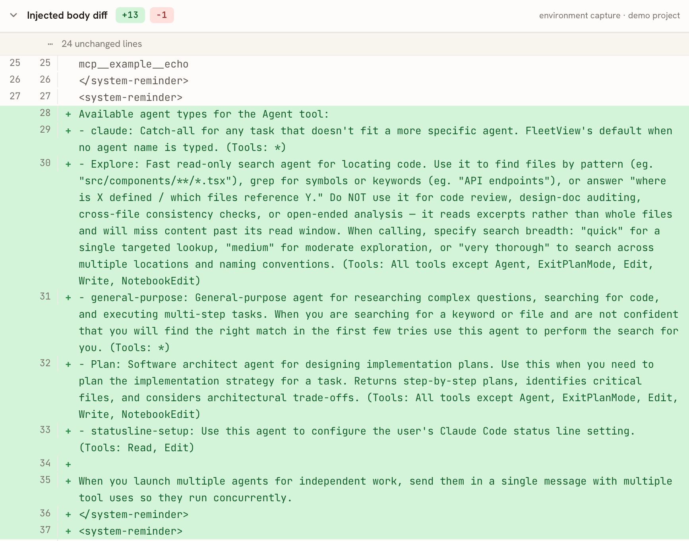

# findings.md — how each Claude Code version loads your custom files

**English** | [中文](findings.zh-CN.md)

**Current corpus**: counts and slicing go by `manifest.json`'s `.counts`. The baseline — 2.0.0 through 2.1.201, every version and every pinned-model variant — was captured in one pass on 2026-07-06 in a single environment, so within it cross-version differences read as version signal rather than capture-date drift; versions after the baseline are captured as they ship (each sample records its own `captured_at`). Variants follow each model family's era, and exist only where the model isn't already that version's default: the sonnet axis is the canonical request itself through 2.0.50 (sonnet-4-5 was the default), the `claude-sonnet-4-5` variant from 2.0.51, and hands over to `claude-sonnet-5` from 2.1.197 (the handover version carries both); `claude-haiku-4-5` covers the whole line; `claude-fable-5[1m]` starts at 2.1.170. Default model chain sonnet-4-5 → opus-4-5 → opus-4-6 → opus-4-7 → opus-4-8, with `max_tokens` raised at 2.1.76(32000) → 2.1.77(64000). The built-in tool set gains `ReportFindings` at 2.1.196 (version-gated: back-to-back re-captures of 2.1.195/2.1.196 under identical conditions reproduce the boundary). The `# userEmail` context block appears from 2.1.108 and is present continuously after.

---

## Sample files (the objects being captured)

The capture working dir is `/tmp/example/` (snapshot in `example-artifacts/`, memory in `example-artifacts/memory-snapshot/`):

| Type | Example | Source file | How it appears in the request |
|---|---|---|---|
| **CLAUDE.md** | project notes (Vite/TypeScript, "answer concisely") | `CLAUDE.md` | injected context: a `# claudeMd` system-reminder block inside messages, verbatim (not in the top-level `system[]` blocks; from 2.1.154 the new `role:"system"` message in messages also counts as messages) |
| **hook** | SessionStart injects `Session note: example project loaded…` | `.claude/settings.json` | at session start Claude Code runs this command and puts its printed output (stdout) into messages (i.e. injected context). SessionStart is just one of the hook's several trigger points (others: UserPromptSubmit / PreToolUse / PostToolUse / Stop, etc.); this repo's example uses it |
| **skill** | `greeter` (Greet the user by name) | `.claude/skills/greeter/SKILL.md` | presented in two generations, **judged by position, not by literal text**: 2.0.9–2.1.22 inside the **tool description** (carrier tool SlashCommand→Skill; the literal changes by version: `/greeter` slash line → `<skill>` block → `- greeter:` list line); from 2.1.23 it moves to the `- greeter:` list line in **injected context** (messages) (a clean [2.1.22→2.1.23](https://api-requests.cc/#/en/diff/2.1.22/2.1.23?focus=context) switch, no version with both) |
| **tool (MCP)** | server `example` → tool `mcp__example__echo` | `.mcp.json` + `example-mcp.py` | see "MCP carriage" below |
| **memory** | `reply-style` / `project-stack` / `naming` (3 types) | `~/.claude/projects/-private-tmp-example/memory/` | **content injection** (the `MEMORY.md` index lines / the "user's auto-memory" section) inside the claudeMd block in messages, from 2.1.59. Note the distinction: the memory **feature description** ("`MEMORY.md` is always loaded…") is in the system prompt from 2.1.59 — that's tool documentation, not sample-file content |

Capture commands (details in [../capture/README.md](../capture/README.md)):
```bash
../capture/capture.sh --force --skip-preflight                       # full re-capture
../capture/capture.sh --only "2.1.170" --refresh-versions --force    # add one version
```
To avoid mixing in the skills/plugins/MCP actually installed in the environment, the capture runs from a separate config dir `~/.claude-demo-capture` (`CLAUDE_CONFIG_DIR`).

---

## Version tracking

| Custom file | First 2.* version | Verified conclusion |
|---|---|---|
| **CLAUDE.md** | [**2.0.0**](https://api-requests.cc/#/en/v/2.0.0) | supported throughout |
| **hook** (SessionStart injection) | [**2.0.0**](https://api-requests.cc/#/en/v/2.0.0) | supported, **but missing in 2.0.17–2.0.29** ([2.0.15 has it → 2.0.17 doesn't](https://api-requests.cc/#/en/diff/2.0.15/2.0.17?focus=context), [restored at 2.0.30](https://api-requests.cc/#/en/diff/2.0.29/2.0.30?focus=context)) |
| **skill** (`.claude/skills`) | [**2.0.9**](https://api-requests.cc/#/en/v/2.0.9) | supported, **but missing in 2.0.18–2.0.19** ([gone](https://api-requests.cc/#/en/diff/2.0.17/2.0.18?focus=tools), [back](https://api-requests.cc/#/en/diff/2.0.19/2.0.20?focus=tools)) |
| **MCP auto-load** (`.mcp.json`) | [**2.0.66**](https://api-requests.cc/#/en/v/2.0.66) | 2.0.64/2.0.65 absent; **stable inline from 2.0.66** ([2.0.65→2.0.66](https://api-requests.cc/#/en/diff/2.0.65/2.0.66?focus=tools), tools=18), **deferred loading from 2.1.69** ([2.1.68→2.1.69](https://api-requests.cc/#/en/diff/2.1.68/2.1.69?focus=tools), the tool name moves into the deferred enumeration) |
| **memory** | [**2.1.59**](https://api-requests.cc/#/en/v/2.1.59) | 2.1.58 absent, appears from 2.1.59 ([2.1.58→2.1.59](https://api-requests.cc/#/en/diff/2.1.58/2.1.59?focus=context), tools=19) |

### MCP carriage
The form of the MCP tool `mcp__example__echo` changes by version, in two stages:
- **2.0.66 – 2.1.68 (inline)**: the full tool schema is **inlined** into `request.body.tools[]`.
- **From 2.1.69 (deferred)**: `ToolSearch` first appears as **a real tool in `tools[]`** at **2.1.69** (the same version MCP stops being inlined); after that `tools[]` no longer inlines MCP — only `ToolSearch`, and the real tool name `mcp__example__echo` is listed in the **deferred-tools enumeration** in the injected context (the message form that carries the enumeration evolves with the "message structure", see below; the deferred-note wording also changes by version, so don't match a fixed sentence). The **string** `ToolSearch` appears in other tool descriptions as early as 2.1.16 (e.g. WebFetch's "use ToolSearch first…"), so a full-text grep would mis-measure it as early as 2.1.16.

> [!note]
>
> If the MCP server hasn't connected during a conversation (the connection doesn't beat the first request), the `mcp__<server>__*` tools drop out of the deferred enumeration in the request body and are replaced by a still-connecting note:
>
> 
>
> No sample in the current corpus exhibits this — every capture (canonical and variant) completed with the server connected. The race is inherent to headless `-p`, though: under unfavorable conditions a capture can still lose it (earlier snapshots preserved in the repo's git history did, at 2.1.153–2.1.173).

### Evolution of the injected-message structure
The form of `messages[]` currently comes in four generations:

- **2.0.0 – 2.1.68**: a single user message (content array).
- **2.1.69 – 2.1.109**: **two user messages** — the first is a **string** content, namely the `<available-deferred-tools>` enumeration (the first-generation carrier of the deferred mechanism); the second is a 4-block array.
- **2.1.110 – 2.1.153**: back to a **single user message** (5-block array), with the deferred enumeration moved into a system-reminder block inside the array (the fixed phrase "The following deferred tools…" appears from here).
- **From 2.1.154**: user (2 blocks) + one string-typed `role:"system"` message, with the deferred/skills/hook context merged into the latter.

> Two scanning gotchas: `content` may be a string rather than an array (2.1.69–2.1.109 and 2.1.154+), so iterating only arrays misses cases; and the user message isn't necessarily a single one.
> You can show "tool name appears" and "is the schema inlined" as separate things — an independent evolution axis introduced by the ToolSearch mechanism.

### What happens with `--system-prompt-file`?

Passing `--system-prompt-file <file>` **replaces the default agent-instruction blocks**. Taking a ~122KB (1597-line) custom system-prompt file `CLAUDE-FABLE-5.md` as an example, compared against the default request's `system[]`:

| `system[]` block | Default | With `--system-prompt-file` |
|---|---|---|
| [0] `x-anthropic-billing-header: cc_version=…` | ✓ 85 chars | **kept** (unchanged) |
| [1] `You are a Claude agent, built on Anthropic's Claude Agent SDK.` | ✓ 62 chars | **kept** (unchanged) |
| [2] `You are an interactive agent…` (default instruction) | ✓ 1152 chars | **replaced** |
| [3] `Write code that reads like…` (default instruction) | ✓ 5087 chars | **replaced** |
| [2′] file content | — | **the whole file verbatim as one block** (122,428 chars) |

- **Not a whole-`system[]` replacement**: the transport billing header + the `built on Claude Agent SDK` identity prefix are **always kept**.
- **Not an append**: those two default instruction blocks (block 2+3, ~6.2KB total) vanish entirely, replaced by the single file block. Net effect **4 blocks → 3 blocks**.
- **Only the system prompt's instruction body changes**: `tools` (10 of them), `messages`, `model`, `max_tokens` are unchanged.
- **The file goes in verbatim, unwrapped**: the block starts with the file's first line `# Claude Fable 5 — System Prompt`; 122,750 (file chars) vs 122,428 (landed), a ~322 difference from leading/trailing whitespace and newline normalization.

**Net effect**: the agent runs on the instructions in the file (overriding Claude Code's default "you are an interactive agent…" set), but keeps Claude Code's tool set and injected context. This is a CLI override behavior, not a corpus capture (the corpus is all default requests).

### Differences that aren't about the version

| Difference | Cause |
|---|---|
| **MCP shows still-connecting** | the **race** between the MCP connection and the first-request build (capture timing) |
| **an extra agent-types injection block** | the server-side GrowthBook flag `tengu_agent_list_attach` **×** a client code path (≥2.1.84), present only when both hold (same build once captured without it, then with it, three days apart). The current corpus — captured with the flag on — shows it from 2.1.84 continuously, so there it reads as a clean version boundary |
| **the deferred-tools list drifts by capture conditions** (`RemoteTrigger`↔`LSP` swap, `DesignSync` appears…) | which deferred tools are enumerated = (the server flags currently on) × (the client version) |

> **agent-types injection block**
>
> 
