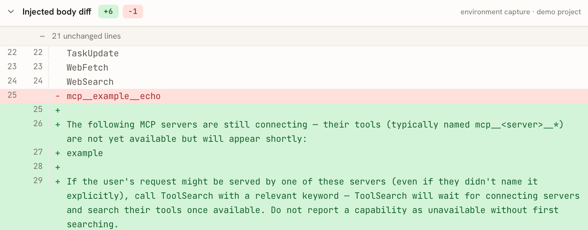
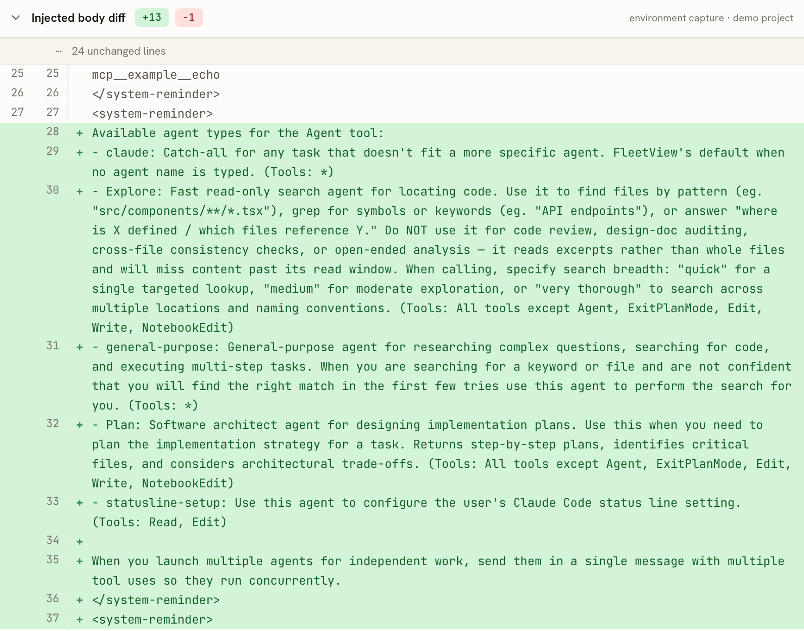

# findings.md — Claude Code 各版本如何加载自定义文件

[English](findings.md) | **中文**

**当前语料**：计数与切分以 `manifest.json` 的 `.counts` 为准。基线部分——2.0.0 至 2.1.201 的每个版本及其钉定模型变体——于 2026-07-06 在同一环境一次性捕获，基线内的跨版本差异反映的是版本本身的变化，而非采集日期带来的漂移；此后的新版本随发布逐个抓取（各样本自带 `captured_at`）。变体按各版本当时的模型抓取，且只在该模型不是当时默认时才单独存在：sonnet 轴在 2.0.50 及之前就是 canonical 本身（sonnet-4-5 即默认），2.0.51 起为 `claude-sonnet-4-5` 变体，2.1.197 起换用 `claude-sonnet-5`（交接版两者皆有）；`claude-haiku-4-5` 覆盖全线；`claude-fable-5[1m]` 自 2.1.170 起，2.1.257 起交接给 `claude-fable-5-1`（交接版两者皆有；Fable 5.1 默认即 1M，故无 `[1m]` 后缀）。默认模型链 sonnet-4-5 → opus-4-5（2.0.51）→ opus-4-6（2.1.32）→ opus-4-7（2.1.111）→ opus-4-8（2.1.154）→ opus-5（2.1.219，该版保留一份 `claude-opus-4-8` 变体作交接标记）→ opus-5-5（2.1.280，该版保留一份 `claude-opus-5` 变体作交接标记；同一构建下钉定的 opus-5 仍带 `# Delivering work`、`# Corrections` 与 effort `high`，故 opus-5-5 更短的提示词与默认 `medium` effort 是模型决定的，不是客户端变化），`max_tokens` 在 2.1.76(32000) → 2.1.77(64000) 抬升，其后仅 opus-5 经服务端灰度升到 128,000，语料中首见于 2.1.278（见非版本差异表）。内置工具集在 2.1.196 新增 `ReportFindings`（版本门控：相同条件下对 2.1.195/2.1.196 背靠背重抓可复现该边界），2.1.207 新增 `DeferredToolPlaceholder`（观察到的边界：四条采集轴在同一版本一齐出现）。`# userEmail` 上下文块自 2.1.108 起出现，其后连续存在。

---

## 示例文件（被捕获的对象）

捕获时的工作目录是 `/tmp/example/`（快照见 `example-artifacts/`、memory 见 `example-artifacts/memory-snapshot/`）：

| 类型 | 示例 | 来源文件 | 在请求里怎么出现 |
|---|---|---|---|
| **CLAUDE.md** | 项目说明（Vite/TypeScript,"answer concisely"） | `CLAUDE.md` | 注入上下文：messages 里 `# claudeMd` system-reminder 块，逐字（不在顶层 `system[]` 块，2.1.154 起 messages 里新增的 `role:"system"` 消息也算在 messages 内） |
| **hook** | SessionStart 注入 `Session note: example project loaded…` | `.claude/settings.json` | 会话开始时 Claude Code 跑这个命令，把它打印出来的内容（stdout）放进 messages（即注入上下文）。SessionStart 只是 hook 的多种触发时机之一（还有 UserPromptSubmit / PreToolUse / PostToolUse / Stop 等），本仓库示例用的是它 |
| **skill** | `greeter`(Greet the user by name) | `.claude/skills/greeter/SKILL.md` | 呈现分两代，**按位置判、非字面**：2.0.9–2.1.22 在**工具描述**里（承载工具 SlashCommand→Skill，字面随版本变：`/greeter` 斜杠行 → `<skill>` 块 → `- greeter:` 列表行）；2.1.23 起改在**注入上下文**(messages) 的列表行 `- greeter:`（[2.1.22→2.1.23](https://api-requests.cc/#/zh/diff/2.1.22/2.1.23?focus=context) 干净切换，没有两处兼有的版本） |
| **tool (MCP)** | server `example` → 工具 `mcp__example__echo` | `.mcp.json` + `example-mcp.py` | 见下方"MCP 承载方式" |
| **memory** | `reply-style` / `project-stack` / `naming`(3 type) | `~/.claude/projects/-private-tmp-example/memory/` | **内容注入**（`MEMORY.md` 索引行/"user's auto-memory" 段）在 messages 的 claudeMd 块内，2.1.59 起。注意区分：memory **功能说明**（"`MEMORY.md` is always loaded…"）从 2.1.59 起在 system prompt 里——是工具说明，非示例文件内容 |

捕获命令（具体见 [../capture/README.zh-CN.md](../capture/README.zh-CN.md)）：
```bash
../capture/capture.sh --force --skip-preflight                       # 全量重抓
../capture/capture.sh --only "2.1.170" --refresh-versions --force    # 加单版本
```
为避免混入环境中真实安装的 skills/plugins/MCP，抓取在独立的 config 目录 `~/.claude-demo-capture`（`CLAUDE_CONFIG_DIR`）下进行。

---

## 版本追踪

| 自定义文件 | 2.* 最早出现版本 | 校对结论 |
|---|---|---|
| **CLAUDE.md** | [**2.0.0**](https://api-requests.cc/#/zh/v/2.0.0) | 全程支持 |
| **hook**（SessionStart 注入） | [**2.0.0**](https://api-requests.cc/#/zh/v/2.0.0) | 支持，**但 2.0.17–2.0.29 缺失**（[2.0.15 有→2.0.17 无](https://api-requests.cc/#/zh/diff/2.0.15/2.0.17?focus=context)，[2.0.30 恢复](https://api-requests.cc/#/zh/diff/2.0.29/2.0.30?focus=context)） |
| **skill**(`.claude/skills`) | [**2.0.9**](https://api-requests.cc/#/zh/v/2.0.9) | 支持，**但 2.0.18–2.0.19 缺失**（[消失](https://api-requests.cc/#/zh/diff/2.0.17/2.0.18?focus=tools)、[恢复](https://api-requests.cc/#/zh/diff/2.0.19/2.0.20?focus=tools)） |
| **MCP 自动加载**(`.mcp.json`) | [**2.0.66**](https://api-requests.cc/#/zh/v/2.0.66) | 2.0.64/2.0.65 无、**2.0.66 起稳定内联**（[2.0.65→2.0.66](https://api-requests.cc/#/zh/diff/2.0.65/2.0.66?focus=tools)，tools=18），**2.1.69 起改延迟加载**（[2.1.68→2.1.69](https://api-requests.cc/#/zh/diff/2.1.68/2.1.69?focus=tools)，工具名移入 deferred 枚举） |
| **memory** | [**2.1.59**](https://api-requests.cc/#/zh/v/2.1.59) | 2.1.58 无、2.1.59 起出现（[2.1.58→2.1.59](https://api-requests.cc/#/zh/diff/2.1.58/2.1.59?focus=context)，tools=19） |

### MCP 承载方式
MCP 工具 `mcp__example__echo` 的形态随版本变化，有两个阶段：
- **2.0.66 – 2.1.68（内联）**：完整 tool schema **内联**进 `request.body.tools[]`。
- **2.1.69 起（延迟）**：`ToolSearch` 作为 **`tools[]` 里的真工具**于 **2.1.69** 首次出现（与 MCP 停止内联同一版），此后 `tools[]` 不再内联 MCP——只有 `ToolSearch`，真正的工具名 `mcp__example__echo` 改在注入上下文的 **deferred 工具枚举**里列出（枚举所在的消息形态随"消息结构"演变，见下；deferred 提示措辞也随版本变，勿按固定句子匹配）。`ToolSearch` 这个**字符串**早在 2.1.16 就出现在别的工具描述里（如 WebFetch 的 "use ToolSearch first…"），全文 grep 会把首现误判到 2.1.16。自 **2.1.207** 起，该机制在 `tools[]` 里多出第二个真工具 `DeferredToolPlaceholder`——一个保留占位符，其描述写明它用于维持 deferred 工具加载、绝不可调用。

> [!note]
>
> 对话时如果 MCP 服务器还没连上（连接没赶在首请求之前完成），请求体里的 `mcp__<server>__*` 工具会从 deferred 枚举消失、被 still-connecting 提示替换：
>
> 
>
> 当前语料中没有此形态的样本——所有采集（canonical 与变体）均在服务器连上后完成。但该竞速是 headless `-p` 固有的：条件不利时采集仍可能输掉（仓库 git 历史保留的早期快照就在 2.1.153–2.1.173 一段输过）。

### 注入消息的结构演变
`messages[]` 的形态当前分六代：

- **2.0.0 – 2.1.68**：单条 user 消息（content 数组）。
- **2.1.69 – 2.1.109**：**两条 user 消息**——第一条是 **string 型** content，内容即 `<available-deferred-tools>` 枚举（deferred 机制初代承载）；第二条是 4 块的数组（2.1.84 起 agent-types 块加入，变 5 块）。
- **2.1.110 – 2.1.153**：并回**单条 user 消息**（6 块数组：hook / deferred 枚举 / agent-types / skills / claudeMd 五个 system-reminder + 提示词），deferred 枚举改为数组内的 system-reminder 块（固定句式 “The following deferred tools…” 自这一代起出现）。
- **2.1.154 – 2.1.206**：user（2 块） + 一条 string 型 `role:"system"` 消息，deferred/技能/钩子上下文并入后者。
- **2.1.207 – 2.1.265**（按采集所见）：仍是这两条消息的布局，但 system 消息的 content 变为携带 `cache_control` 的单块**数组**——缓存断点从最后一条 user 消息挪到 system 消息上。
- **2.1.266 起**（按采集所见；**受 flag 门控，不是客户端边界**——见下表）：首轮 user 消息拆成**三个** `<system-reminder>` 块——CLAUDE.md + 记忆（不再带 `# claudeMd` 标题）、`# userEmail`、以及新的 git 署名提醒（`Co-Authored-By` / "Generated with" 两行；Bash 工具描述同步多了一句）——外加提示词。运行时 **Environment** 块（工作目录、git、平台、shell、OS、模型、知识截止）与日期离开缓存的 `system[]`，进入中途 system 消息，其顺序变为 钩子 → `# Environment` → 模型行 → deferred/技能上下文；缓存段的 `# Environment` 只剩静态的模型目录几行（−392 字符）。缓存断点仍在 system 消息上。

> 钉定模型的各轴并不都与 canonical 同形：`claude-haiku-4-5` 从不拿到中途 system 消息（每个样本都是单条 user 消息——2.1.266 布局下为 12 块 / 11 个 reminder），`claude-sonnet-5` 自 2.1.203 起把中途上下文包成多个完整的 `<system-reminder>…</system-reminder>` 对、拼在**同一个** content 块里——数 reminder 要按标签数，不能按块数。

> 两个扫描坑：`content` 可能是 string 而非数组（2.1.69–2.1.109 与 2.1.154–2.1.206），只遍历数组会漏判；user 消息也不一定只有一条。
> 可以把"工具名出现"和"是否内联 schema"分开展示——这是 ToolSearch 机制引入的一个独立演进维度。

### 使用 `--system-prompt-file` 会发生什么？

传 `--system-prompt-file <文件>`，会**替换默认的 agent 指令块**。以 ~122KB（1597 行）的自定义 system prompt 文件 `CLAUDE-FABLE-5.md` 为例，对照默认请求的 `system[]`：

| `system[]` 块 | 默认 | 加 `--system-prompt-file` |
|---|---|---|
| [0] `x-anthropic-billing-header: cc_version=…` | ✓ 85 字符 | **保留**（不变） |
| [1] `You are a Claude agent, built on Anthropic's Claude Agent SDK.` | ✓ 62 字符 | **保留**（不变） |
| [2] `You are an interactive agent…`（默认指令） | ✓ 1152 字符 | **被替换** |
| [3] `Write code that reads like…`（默认指令） | ✓ 5087 字符 | **被替换** |
| [2′] 文件内容 | — | **整文件 verbatim 作一块**（122,428 字符） |

- **不是整 `system[]` 替换**：transport 的 billing 头 + `built on Claude Agent SDK` 身份前缀**固定保留**。
- **不是 append**：默认那两块指令（block 2+3，共 ~6.2KB）整段消失、被文件那一块取代。净效果 **4 块 → 3 块**。
- **只动 system prompt 的指令体**：`tools`（10 个）、`messages`、`model`、`max_tokens` 不变。
- **文件逐字放入、无包裹**：该块以文件首行 `# Claude Fable 5 — System Prompt` 起；122,750（文件字符）vs 122,428（落入），差 ~322 为首尾空白/换行归一。
- **数字口径**：“默认”列取自实验自身的基线 run，是**线上原始长度**。语料快照中同期版本（2.1.170–2.1.186）该块显示 5,077 字符，差的 10 字符来自脱敏：system[3] 的 `# Memory` 一节含捕获者真实 home 前缀，[sanitize](../sanitize/README.zh-CN.md) 将其替换为 `~`（不保长），全块仅此一处替换。四块中只有它含该路径，其余各块与语料逐字一致。

**实际效果**：agent 以文件里的指令运行（覆盖 Claude Code 默认的"你是个交互式 agent…"那套），但保留 Claude Code 的工具集与注入上下文。此为 CLI 覆盖行为、非语料捕获（corpus 全是默认请求）。

### 与版本无关的差异

| 差异 | 原因 |
|---|---|
| **MCP 显示 still-connecting** | MCP 连接 vs 首请求构建的**竞速**（采集时机） |
| **多出 agent-types 注入块** | 服务端 GrowthBook flag `tengu_agent_list_attach` **×** 客户端代码路径（≥2.1.84），两者同时满足时出现（同一构建曾相隔三天先抓无、后抓有）。当前语料在 flag 开启期捕获，2.1.84 起连续存在，因此在语料中呈现为干净的版本边界 |
| **deferred 工具列表随采集条件漂移**（`RemoteTrigger`↔`LSP` 互换、多出 `DesignSync`…） | 枚举出哪些 deferred 工具 =（当时开着的服务端 flag）×（客户端版本） |
| **2.1.266 的 reminder 布局**（首轮拆块、Environment 与日期进中途 system 消息、git 署名提醒） | 服务端 flag（GrowthBook，缓存在共用的配置目录里、由任一运行的客户端刷新）**×** 两个客户端下限。2026-09-10 在 flag 开启下重采：2.1.250 旧，**2.1.251** 起首轮拆块与 Environment 迁移，**2.1.265** 起多出署名提醒（2.1.263 没有）。按发布即采的样本恰在 2026-09-09 日中撞上翻转：2.1.265 canonical（较早）旧、其钉定模型变体（约 3 小时后）新、2.1.266 起新——因此语料时间线把边界显示在 2.1.266，而客户端下限其实更低 |
| **`mid-conversation-system-clear-at-2026-08-21` beta**（带中途 system 消息的请求：opus-5 / sonnet-5 / fable-5-1，haiku 无） | 2026-09-17 观察到的服务端灰度：当日重采的 2.1.273（sonnet）与 2.1.274（opus）都带它，09-16 按发布即采的 2.1.274 canonical 不带。语料中它首次出现在 2.1.274 的 sonnet/fable 变体上，因此该版本的模型轴面板把它显示为模型差异、下一个 canonical 又把它显示为版本 delta——两者都是采集日期造成的 |
| **opus-5 的 `max_tokens` 64,000 → 128,000 与系统提示新增的 `<pasted_content>` 段落** | 2026-09-19 相隔六分钟的两次采集之间观察到的服务端灰度：2.1.277 canonical（09:58）两者皆无，2.1.278 canonical（10:04）两者皆有，之后重采的 2.1.277 构建也两者皆有。仅 opus-5——fable-5-1 / sonnet-5 / haiku-4-5 变体保持各自的上限（64,000 / 64,000 / 32,000）与提示词。语料时间线把它显示为 2.1.278 的 delta |
| **同步的 claude.ai 技能列表**（2.1.275 起中途 system 消息里的 `anthropic-skills:*` 条目） | 采集时拉取的账号状态，不是客户端内容：列表逐次采集增长（2026-09-18 有 5 条，之后陆续出现 `morning`、`pdf`、`docx`——`docx` 在相隔一分钟采集的两个 2.1.277 变体之间出现）。2.1.275 起的 `context_body_changed` 标记多数是这种漂移 |
| **fable-5-1 系统提示失去 `# Reporting outcomes`**（−907 字符，system 块 5 → 4，语料中首见于 2.1.276 变体） | 2026-09-18 至 09-19 之间的服务端灰度：09-19 重采的、钉定 fable-5-1 的 2.1.275 构建也是同样的 4 块提示词。仅 fable；当天 opus-5 的提示词未变 |
| **opus-5-5 上的 `fallbacks: "default"` 与 `server-side-fallback-2026-07-01` / `fallback-credit-2026-06-01` beta**（仅 2.1.280 canonical） | 2026-09-24 发布日的灰度：几分钟后采集的 2.1.281 canonical 已没有，2026-09-25 重采的 2.1.280 构建也没有——时间线在 2.1.281 显示的 `betas_removed` 是采集日期造成的 |
| **sonnet-5 / haiku-4-5 变体上的 `thread: {"type":"create"}` 请求体字段与 `message-threads-2026-08-12` beta**（语料中首见于 2.1.280） | 服务端灰度：2026-09-25 重采的、钉定 sonnet-5 的 2.1.278 构建两者皆有。opus-5-5 与 fable-5-1 不发送 |
| **sonnet-5 变体切换到 opus 系的系统提示**（`# Harness` / `# Memory`，约 6.7K 字符而非 27K，五个内置工具的描述随之改写） | 在采集之间来回翻转的 flag：2.1.281 变体（2026-09-24）开、2.1.280 与 2.1.282 关、2026-09-25 重采的 2.1.278 与 2.1.281 构建又开。`max_tokens` 128,000 随同一 flag 出现，但只在 ≥ 2.1.281 的构建上（flag 开启的 2.1.278 构建仍是 64,000）。因此 sonnet 视角在 2.1.281 显示切入、在 2.1.282 显示切出 |

> **agent-types 注入块**
>
> 
